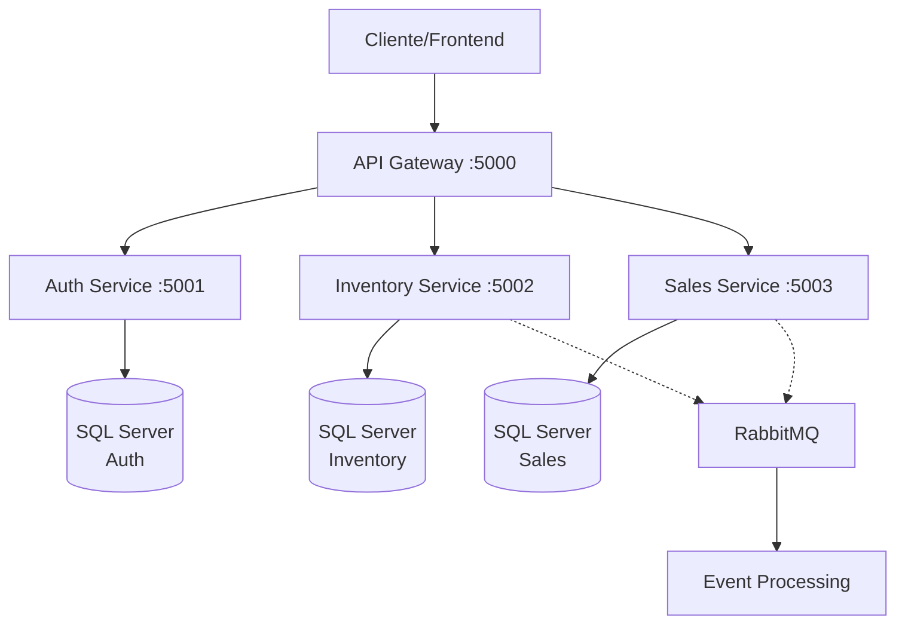

# 🛒 E-Commerce Microservices Platform

[](https://dotnet.microsoft.com/)
[](https://microservices.io/)
[](LICENSE)

> Sistema profissional de e-commerce baseado em microserviços usando .NET Core, implementando gestão de estoque e vendas com comunicação assíncrona via RabbitMQ.

## 🎯 Visão Geral

Este projeto implementa uma **arquitetura de microserviços completa** para uma plataforma de e-commerce, seguindo as melhores práticas da indústria e padrões de design modernos.

### 🏗️ Arquitetura



## 🚀 Quick Start

### 1️⃣ **Instalação Rápida**
```powershell
# Clone o repositório
git clone <repository-url>
cd DESAFIO_TECNICO_AVANADE

# Execute o script de configuração
.\scripts\install-dependencies.ps1

# Inicie todos os serviços
.\scripts\run-all-services.ps1
```

### 2️⃣ **Acesse as APIs**
- **🌐 API Gateway**: http://localhost:5000/swagger
- **🔐 Auth API**: http://localhost:5001/swagger  
- **📦 Inventory API**: http://localhost:5002/swagger
- **� Sales API**: http://localhost:5003/swagger

### 3️⃣ **📋 [GUIA COMPLETO DE TESTES](GUIA_TESTES.md)**
**👆 Clique aqui para instruções detalhadas de como testar todo o sistema!**

## 🔧 Tecnologias

### **📋 Pré-requisitos**
- **🎯 .NET 8.0 SDK** - [Download](https://dotnet.microsoft.com/download/dotnet/8.0)
- **🗄️ SQL Server** (LocalDB/Express) - [Download](https://www.microsoft.com/sql-server/sql-server-downloads)  
- **🐰 RabbitMQ Server** - [Download](https://www.rabbitmq.com/download.html)
- **💻 Visual Studio Code** com extensões:
  - C# Dev Kit
  - REST Client

### **Backend Stack**
- **🎯 .NET 8.0** - Framework principal
- **🗃️ Entity Framework Core** - ORM + Migrations
- **🐰 RabbitMQ** - Message Broker para comunicação assíncrona
- **🔐 JWT** - Autenticação e autorização
- **🎪 Ocelot** - API Gateway
- **📝 Serilog** - Logging estruturado
- **✅ FluentValidation** - Validações robustas

### **Arquitetura & Patterns**
- **🏛️ Clean Architecture** (API → Core → Infrastructure)
- **📚 Repository Pattern** + Unit of Work
- **🎭 CQRS** principles
- **🎯 Domain-Driven Design** (DDD)
- **🔄 Event-Driven Architecture**

### **DevOps & Tools**
- **🐳 Docker** + Docker Compose
- **🔍 Swagger/OpenAPI** - Documentação automática
- **🧪 xUnit** - Testes automatizados
- **📊 Health Checks** - Monitoramento

## 📁 Estrutura do Projeto

```
📦 DESAFIO_TECNICO_AVANADE/
├── 📂 src/
│   ├── 📂 Services/
│   │   ├── 📂 Inventory/           # 🏪 Serviço de Estoque
│   │   │   ├── 📂 Inventory.API/         # Controllers + Configuration
│   │   │   ├── 📂 Inventory.Core/        # Domain Logic + DTOs
│   │   │   └── 📂 Inventory.Infrastructure/ # Data Access + Repositories
│   │   ├── 📂 Sales/               # 💰 Serviço de Vendas
│   │   ├── 📂 Authentication/      # 🔐 Serviço de Autenticação
│   │   └── 📂 Gateway/            # 🌐 API Gateway
│   └── 📂 Shared/
│       ├── 📂 Common/             # 🔧 Utilitários compartilhados
│       ├── 📂 EventBus/           # 🚌 Message Bus (RabbitMQ)
│       └── 📂 Contracts/          # 📋 Event Contracts
├── 📂 tests/                      # 🧪 Testes automatizados
├── 📂 docker/                     # 🐳 Docker configuration
└── 📂 scripts/                    # 🛠️ Scripts de automação
```

## 🌐 APIs Disponíveis

### **📦 Inventory Service** (Porto 5002)

#### **Produtos**
```http
GET    /api/products              # Listar produtos
POST   /api/products              # Criar produto
GET    /api/products/{id}         # Buscar produto
PUT    /api/products/{id}         # Atualizar produto
DELETE /api/products/{id}         # Excluir produto
GET    /api/products/category/{category} # Produtos por categoria
```

#### **Estoque**
```http
GET    /api/products/{id}/stock/{quantity} # Verificar disponibilidade
PATCH  /api/products/{id}/stock           # Atualizar estoque
```

### **💰 Sales Service** (Porto 5003)
```http
GET    /api/orders                # Listar pedidos
POST   /api/orders                # Criar pedido
GET    /api/orders/{id}           # Buscar pedido
PUT    /api/orders/{id}/status    # Atualizar status
```

### **🔐 Authentication Service** (Porto 5001)
```http
POST   /api/auth/login            # Fazer login
POST   /api/auth/register         # Registrar usuário
POST   /api/auth/refresh          # Renovar token
```

## 🧪 Testando as APIs

### **Usando REST Client (VS Code)**
```http
### Criar produto
POST http://localhost:5002/api/products
Content-Type: application/json

{
  "name": "Notebook Gamer ROG",
  "description": "Notebook ASUS ROG Strix G15 - RTX 4060",
  "price": 4999.99,
  "stock": 15,
  "category": "Electronics"
}

### Listar produtos
GET http://localhost:5002/api/products
```

### **Usando PowerShell**
```powershell
# Listar produtos
Invoke-RestMethod -Uri "http://localhost:5002/api/products" -Method GET

# Criar produto
$body = @{
    name = "Produto Teste"
    description = "Descrição do produto"
    price = 99.99
    stock = 10
    category = "Test"
} | ConvertTo-Json

Invoke-RestMethod -Uri "http://localhost:5002/api/products" -Method POST -Body $body -ContentType "application/json"
```

## ⚡ Scripts de Desenvolvimento

```powershell
# 🔧 Verificar e instalar dependências (.NET, SQL Server, etc.)
.\scripts\install-dependencies.ps1

# 🚀 Executar serviço específico
.\scripts\run-service.ps1 inventory    # Apenas Inventory API
.\scripts\run-service.ps1 sales        # Apenas Sales API  
.\scripts\run-service.ps1 auth         # Apenas Auth API
.\scripts\run-service.ps1 gateway      # Apenas API Gateway

# 🎪 Executar todos os serviços de uma vez
.\scripts\run-all-services.ps1

# 🛑 Parar todos os serviços
.\scripts\stop-all-services.ps1

# 📦 Criar/atualizar migrations de banco
.\scripts\create-migrations.ps1

# 🔧 Setup inicial completo do ambiente
.\scripts\setup.ps1
```

## 🧪 Como Testar se Tudo Está Funcionando

### **🎯 Teste Rápido (1 minuto)**
```powershell
# 1. Validação rápida do sistema
.\quick-test.ps1

# 2. Se tudo OK, executar todos os serviços
.\scripts\run-all-services.ps1

# 3. Acessar documentação interativa
# Abra: http://localhost:5000/swagger
```

### **🔬 Teste Completo**
**📋 [GUIA COMPLETO DE TESTES](GUIA_TESTES.md)** - Instruções detalhadas
**⚡ [VALIDAÇÃO RÁPIDA](VALIDACAO_RAPIDA.md)** - Verificação em 1 minuto

## 🔍 Monitoramento & Logs

### **Health Checks**
- **Inventory**: http://localhost:5002/health
- **Sales**: http://localhost:5003/health
- **Auth**: http://localhost:5001/health

### **Logs Estruturados**
```powershell
# Ver logs em tempo real
Get-Content src/Services/Inventory/Inventory.API/logs/inventory-api-*.txt -Wait -Tail 50
```

## 🚀 Execução em Produção

### **Com Docker Compose**
```bash
cd docker
docker-compose up -d
```

### **URLs de Produção**
- **API Gateway**: http://localhost:5000
- **Documentação**: http://localhost:5000/swagger

## 🧪 Testes

```powershell
# Executar todos os testes
dotnet test

# Testes com cobertura
dotnet test --collect:"XPlat Code Coverage"

# Testes de integração
dotnet test tests/Integration.Tests
```

## 📊 Funcionalidades Implementadas

### ✅ **Authentication Service** (Porto 5001)
- ✅ Sistema completo de autenticação JWT
- ✅ Registro e login de usuários
- ✅ Geração e validação de tokens
- ✅ Autorização por roles
- ✅ Health checks e logging

### ✅ **Inventory Service** (Porto 5002)
- ✅ CRUD completo de produtos
- ✅ Controle de estoque com validações
- ✅ Consultas por categoria
- ✅ Eventos de atualização de estoque via RabbitMQ
- ✅ Health checks e logging estruturado

### ✅ **Sales Service** (Porto 5003)
- ✅ Criação e gestão de pedidos
- ✅ Validação de estoque antes da venda
- ✅ Comunicação assíncrona com Inventory via RabbitMQ
- ✅ Cálculos automáticos de totais
- ✅ Controle de status de pedidos

### ✅ **API Gateway** (Porto 5000)
- ✅ Roteamento para todos os microserviços
- ✅ Autenticação centralizada JWT
- ✅ Rate limiting e configurações de segurança
- ✅ Documentação Swagger agregada
- ✅ CORS configurado

### ✅ **RabbitMQ Event Bus**
- ✅ Comunicação assíncrona entre serviços
- ✅ Eventos de atualização de estoque
- ✅ Processamento de pedidos
- ✅ Retry policies e error handling

### ✅ **Infraestrutura**
- ✅ Entity Framework Core com SQL Server
- ✅ Clean Architecture em todos os serviços
- ✅ Repository Pattern + Unit of Work
- ✅ Logging estruturado com Serilog
- ✅ Health checks em todos os serviços
- ✅ Docker Compose para execução completa

## 🤝 Contribuindo

1. **Fork** o projeto
2. Crie uma **branch** para sua feature (`git checkout -b feature/amazing-feature`)
3. **Commit** suas mudanças (`git commit -m 'Add amazing feature'`)
4. **Push** para a branch (`git push origin feature/amazing-feature`)
5. Abra um **Pull Request**

## 📄 Licença

Este projeto está sob a licença **MIT**. Veja o arquivo [LICENSE](LICENSE) para detalhes.

---

<div align="center">

**🎉 Sistema de E-Commerce Profissional com Microserviços!**

[](https://github.com/yourusername)
[](https://dotnet.microsoft.com/)

</div>
